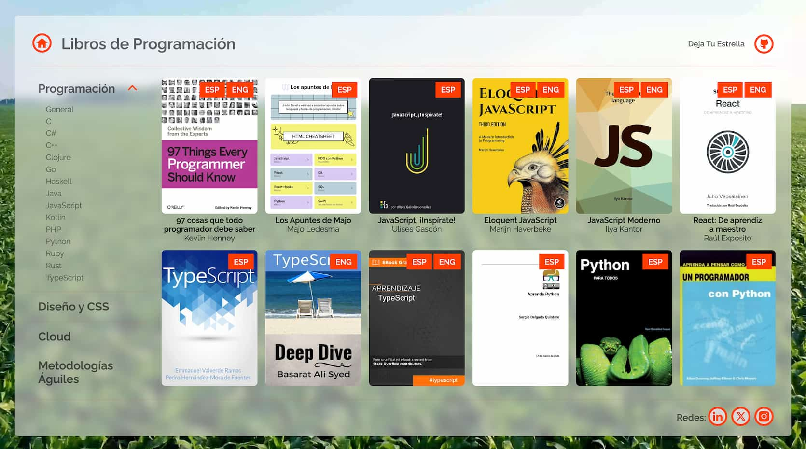

# Libros Gratis de Programación

  
Explora +70 libros de programacion, diseño base de datos, metodologias aguiles, etc.: <a href="https://librosdeprogramacion.netlify.app/" target="_blank">Aqui</a> encuentra la pagina web
  

  

    
  

## Descripción

En la pagina se encuentra varios temas en Programación:

[Lenguje de Programacion](https://librosdeprogramacion.netlify.app/general) 

[Diseño y CSS](https://librosdeprogramacion.netlify.app/diseno-ui-ux) 

[Cloud](https://librosdeprogramacion.netlify.app/cloud) 

[Metodologias Aguiles](https://librosdeprogramacion.netlify.app/metodologias-agiles) 

[Base de datos](https://librosdeprogramacion.netlify.app/base-de-datos) 

[Otros](https://librosdeprogramacion.netlify.app/otros) 

## Socials

- Website - [https://chipre.netlify.app/](https://chipre.netlify.app/)
- Linkedin - [@alexchipre](https://www.linkedin.com/in/alexchipre/)
- Twitter - [@chipredev](https://twitter.com/chipredev)
- Instagram - [@chipredev](https://www.instagram.com/chipredev/)

